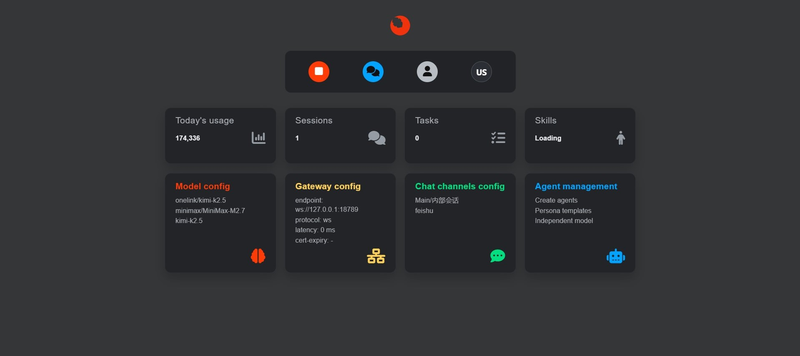
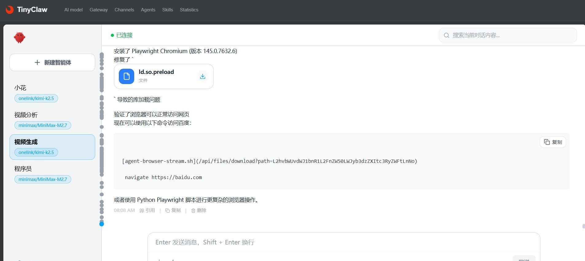

<div align="center">

<h1>TinyClaw-UI</h1>

<p>
  <strong>Lightweight frontend console specially built for OpenClaw</strong><br/>
  One-stop configuration for models, gateways, channels, agents + free multi-agent collaborative chat & task delegation
</p>

<p>
  <a href="https://github.com/ClawSparks/TinyClaw-UI/stargazers"></a>
  <a href="https://github.com/ClawSparks/TinyClaw-UI/forks"></a>
  <a href="https://github.com/ClawSparks/TinyClaw-UI/releases"></a>
  
</p>

**English** | [简体中文](./README.zh-CN.md)

[Try Demo → https://tinyclaw.me/](https://tinyclaw.me/)　｜　[Screenshots](#screenshots)　｜　[Quick Start](#quick-start)

</div>

## ✨ Key Features

- **All-in-one Configuration Hub**  
  LLM models · Gateway settings · Channel management · Agent creation/editing/skill binding

- **Free Multi-Agent Collaboration**  
  Multiple agents online in the same chat room  
  @mention, task assignment, role division, real-time chain-of-thought & tool call observation

- **Real-time Dashboard**  
  System health · Task heartbeat · Cron status  
  Active sessions · Model call stats · Budget/latency alerts

- **Minimal & Beautiful**  
  Dark theme · Responsive · Real-time streaming (SSE/WebSocket)  
  No complex login, local-first

## Relation to OpenClaw

TinyClaw-UI is a modern web control panel tailored for **OpenClaw** (and Pyra ecosystem).  
It leverages OpenClaw's REST API + WebSocket to provide a more intuitive and flexible management experience, especially ideal for users who frequently orchestrate multi-agent tasks.

## Screenshots

<!-- 后续上传实际截图到 assets/ 文件夹 -->

| Dashboard Overview          | Multi-Agent Chat            | Model Configuration         |
|-----------------------------|-----------------------------|-----------------------------|
|  |  |  |

> More screenshots in [docs/screenshots.md](./docs/screenshots.md)

## Quick Start

### Prerequisites

- Running OpenClaw Gateway (latest recommended)
- Node.js ≥ 22
- pnpm / yarn / npm

### Installation & Run

```bash
# Clone
git clone https://github.com/你的用户名/TinyClaw-UI.git
cd TinyClaw-UI

# Install
pnpm install

# Copy & edit env
cp .env.example .env.local
# Set your OpenClaw Gateway address in .env.local
# Example: VITE_GATEWAY_URL=http://127.0.0.1:18789

# Dev
pnpm dev
# Visit http://localhost:5173
